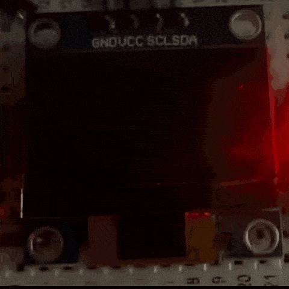

# 基于STM32F103C8T6的智能手表系统

> 这是一个基于 STM32F103C8T6 微控制器的智能手表原型项目，集成了时间显示、菜单交互、闹钟/倒计时、小游戏、动态表情、电源管理和姿态唤醒等功能。项目采用裸机开发，代码模块化分层设计，便于学习和扩展。

---

## 目录

- [基于STM32F103C8T6的智能手表系统](#基于stm32f103c8t6的智能手表系统)
  - [目录](#目录)
  - [项目简介](#项目简介)
  - [硬件连接](#硬件连接)
    - [硬件清单](#硬件清单)
    - [引脚连接表](#引脚连接表)
    - [实物连接图](#实物连接图)
  - [功能列表](#功能列表)
  - [软件架构](#软件架构)
    - [开发环境](#开发环境)
    - [代码结构](#代码结构)
    - [主循环流程](#主循环流程)
  - [核心模块设计](#核心模块设计)
    - [1-菜单系统](#1-菜单系统)
    - [2-按键处理](#2-按键处理)
    - [3-定时器与任务调度](#3-定时器与任务调度)
    - [4-实时时钟 RTC](#4-实时时钟-rtc)
    - [5-时间设置](#5-时间设置)
    - [6-闹钟](#6-闹钟)
    - [7-倒计时](#7-倒计时)
    - [8-手电筒](#8-手电筒)
    - [9-动态表情](#9-动态表情)
    - [10-谷歌小恐龙游戏](#10-谷歌小恐龙游戏)
    - [11-电量检测与显示](#11-电量检测与显示)
    - [12-自动息屏与唤醒](#12-自动息屏与唤醒)
    - [13-抬手唤醒](#13-抬手唤醒)
    - [14-电源管理（模拟开关机）](#14-电源管理模拟开关机)
  - [使用说明](#使用说明)
  - [后续规划](#后续规划)
  - [致谢](#致谢)

---

## 项目简介

本项目基于 **STM32F103C8T6** 微控制器，配合 **0.96寸OLED显示屏**、**三个独立按键**、**有源蜂鸣器**、**LED**、**MPU6050六轴传感器** 和 **电位器** 等外设，实现了一个功能丰富的智能手表原型。

**主要特点**：
- 裸机开发，代码结构清晰，模块化分层设计。
- 完整的菜单导航系统，支持多级页面切换和滚动动画。
- 非阻塞按键扫描，支持短按/长按识别。
- 定时器中断驱动任务调度，实时性好。
- 多种实用功能：时间设置、闹钟、倒计时、手电筒、游戏、动态表情等。
- 电源管理：自动息屏、按键唤醒、抬手唤醒、模拟开关机。

<div align="center">
<p align="center">
    <br>
    演示效果(因gif压缩会有加速)
  </p>
  <br>
  <table>
    <tr>
      <td align="center"><br>主界面</td>
      <td align="center"><br>菜单界面</td>
      <td align="center"><br>时间功能界面</td>
    </tr>
    <tr>
      <td align="center"><br>手电筒界面</td>
      <td align="center"><br>游戏功能界面</td>
      <td align="center"><br>表情包界面</td>
    </tr>
  </table>
</div>

<p align="center"><strong>视频链接</strong></p>


---

## 硬件连接

### 硬件清单

| 模块 | 型号/规格 | 用途 |
|------|------|------|
| 主控 | STM32F103C8T6 | 核心处理器 |
| 显示屏 | 0.96寸OLED（I2C，SSD1306） | 显示界面 |
| 按键 | 3 个独立按键（Key1/Key2/Key3） | 用户交互 |
| 蜂鸣器 | 有源蜂鸣器（高电平触发） | 闹钟/倒计时提醒 |
| LED | 普通发光二极管（低电平点亮） | 模拟手电筒 |
| 姿态传感器 | MPU6050 (I2C) | 抬腕检测 |
| 电位器 | 10kΩ | 模拟电池电压变化 |
| 仿真器 | ST-LINK V2 | 下载/调试程序 |

### 引脚连接表

| 模块 | 引脚 | 说明 |
|------|------|------|
| OLED_SCL | PB6 | I2C时钟线 |
| OLED_SDA | PB7 | I2C数据线 |
| 按键1（Key1） | PB13 | 进入菜单 / 返回上一级 |
| 按键2（Key2） | PB14 | 向下选择 / 切换高亮项 |
| 按键3（Key3） | PB15 | 确认 / 数值加 / 长按开关机 |
| 蜂鸣器 | PB1 | 高电平触发 |
| LED（手电筒） | PB12 | 低电平点亮 |
| MPU6050_SCL | PB10 | I2C时钟线 |
| MPU6050_SDA | PB11 | I2C数据线 |
| 电位器（ADC） | PA0 | ADC 输入，模拟电池电压 |

### 实物连接图
<div align="center">
<p align="center">
    <br>
    智能手表实物整体图
  </p>
  <br>
</div>

---

## 功能列表

- [x] **实时时间显示**：年/月/日 + 星期 + 时/分/秒，主界面与菜单状态栏动态展示。
- [x] **多级菜单导航**：主菜单 → 功能列表 → 子功能页面，支持返回与选择。
- [x] **时间设置**：手动修改年月日时分秒，并写入RTC。
- [x] **闹钟**：设置小时和分钟，闹钟触发后非阻塞蜂鸣提醒，可手动关闭。
- [x] **倒计时**：设置时/分/秒，支持开始、暂停、复位，归零后蜂鸣提醒。
- [x] **手电筒**：按键控制LED开关，带非阻塞动画反馈。
- [x] **谷歌小恐龙游戏**：按键跳跃躲避障碍物，实时得分显示，碰撞后退出。
- [x] **动态表情**：多帧图片按定时切换，呈现动画效果。
- [x] **自动息屏**：20秒无操作自动关闭OLED显示。
- [x] **按键唤醒**：息屏状态下按任意键点亮屏幕。
- [x] **抬手唤醒**：MPU6050 检测抬腕动作自动亮屏。
- [x] **电量显示**：ADC采样 + 滑动平均滤波，显示电池百分比和三格图标。
- [x] **模拟开关机**：长按 Key3 进入低功耗模式（软件模拟），再次长按开机复位。

---

## 软件架构

### 开发环境

| 项目 | 说明 |
|------|------|
| IDE | Keil MDK v5 |
| 编译器 | ARM Compiler 5 |
| 标准库 | STM32F10x Standard Peripherals Library |
| 调试器 | ST-LINK V2 |
| 版本管理 | Git + GitHub |

### 代码结构

```
SmartWatch_STM32/
├── Start/ # 启动文件与系统启动代码
├── Library/ # STM32 标准外设库（CMSIS 等）
├── System/     # 系统服务层：提供基础服务与时基
│ ├── Timer.c/h         # 定时器驱动：TIM2(10ms)、TIM3(1s) 中断与任务调度
│ ├── MyRTC.c/h         # RTC 实时时钟驱动（读写时间、星期计算）
│ └── Delay.c/h         # 微秒/毫秒延时函数
├── Hardware/   # 硬件驱动层：直接操作外设寄存器、总线时序
│ ├── LED.c/h           # LED 控制（手电筒）
│ ├── Key.c/h           # 按键扫描、消抖、长按检测
│ ├── Buzzer.c/h        # 蜂鸣器控制（非阻塞状态机）
│ ├── OLED.c/h          # OLED 显示驱动（SSD1306）
│ ├── OLED_Data.c/h     # OLED 字模与图片数据
│ ├── AD.c/h            # ADC 采集（用于电池电压检测）
│ ├── MyI2C.c/h         # 软件 I2C 驱动
│ ├── MPU6050.c/h       # MPU6050 六轴传感器驱动
│ └── MPU6050_Reg.h     # MPU6050 寄存器定义与常量宏
├── App/        # 应用层：业务逻辑、界面管理、功能模块
│ ├── app.c/h           # 应用初始化和主循环调度（初始化所有模块）
│ ├── menu.c/h          # 菜单系统（状态机、滚动动画、状态栏）
│ ├── time_app.c/h      # 时间功能列表（Time Setting / Alarm / Countdown）
│ ├── time_setting.c/h  # 时间设置子界面
│ ├── alarm.c/h         # 闹钟模块
│ ├── countdown.c/h     # 倒计时模块
│ ├── flashlight.c/h    # 手电筒模块（LED 控制与动画）
│ ├── game_app.c/h      # 游戏列表
│ ├── dino_game.c/h     # 谷歌小恐龙游戏
│ ├── emoji.c/h         # 动态表情模块
│ ├── auto_sleep.c/h    # 自动息屏管理
│ ├── motion_wakeup.c/h # 抬手唤醒检测（MPU6050 数据解析）
│ ├── battery.c/h       # 电池电量计算与图标管理
│ └── power.c/h         # 电源管理（模拟开关机）
├── User/ # 用户入口
└── Project.uvprojx # Keil 工程文件
```

### 主循环流程
```c
int main(void)
{
    App_Init();          // 初始化所有模块

    while (1)
    {
        App_Process();   // 主循环处理，包括按键、秒任务、菜单更新等
    }
}
```
`App_Process` 内部：

1. 长按开关机检测（`Power_HandleLongPress`，关机时阻塞等待开机）。  
2. 处理秒心跳：若 `second_tick_flag` 置位，执行 RTC 读取、闹钟检查、倒计时、自动息屏计时。  
3. 读取按键（非阻塞）。  
4. 抬手唤醒检测。  
5. 根据息屏状态决定响应：若息屏，任意按键唤醒；否则正常处理按键并更新菜单。  

---

## 核心模块设计

### 1-菜单系统

**设计思路**：采用有限状态机管理页面，`page_state_t`枚举定义所有页面。主菜单有三种模式：
- `MENU_MODE_PREVIEW`：显示两个图标，无高亮。
- `MENU_MODE_ACTIVE`：显示两个图标，中间高亮（选中）。
- `MENU_MODE_SCROLL`：显示三个图标，中间高亮，可左右滚动。

**滚动动画**：使用TIM2 10ms中断驱动 `Menu_Tick()`，通过偏移量 `menu_scroll_offset` 实现图标平滑移动，动画期间忽略新的Key2输入，避免冲突。

**关键代码**（菜单滚动动画）：
```c
void Menu_Tick(void)
{
    if (menu_scroll_anim_active)
    {
        menu_scroll_offset += MENU_ANIM_STEP;
        if (menu_scroll_offset >= MENU_ICON_SLOT_WIDTH)
        {
            menu_scroll_offset = 0;
            menu_scroll_anim_active = 0;

            if (menu_anim_type == 1)          // 普通滚动
                menu_index = (menu_index + 1) % icon_count;
            else if (menu_anim_type == 2)     // 特殊动画：从两图标到三图标
                menu_index = 1;

            menu_anim_type = 0;
        }
    }
}
```
---

### 2-按键处理

**设计思路**：摒弃阻塞式扫描，采用**非阻塞状态机 + 定时器中断**。每个按键独立维护4个状态：空闲、消抖、等待释放、释放消抖。同时记录按住时间，用于长按检测。

**长按识别**：当Key3持续按下超过2秒（`hold_count >= 200`），置 `long_press` 标志，并通过 `Key_ReadLongPress()` 供电源模块使用。

**关键代码**（按键状态机片段）：
``` c
case 2:   // 等待释放
	if (current_level == 0)   // 仍按下
	{
		if (!k->long_press_done)   // 如果长按还未被处理
		{
			k->hold_count++;
			if (k->hold_count >= 200)   // 达到2秒
			{
				k->long_press = 1;       // 标记长按
				k->long_press_done = 1;  // 设置为已处理，防止重复设置
				k->hold_count = 0;       // 清零，不再增加
			}
		}
		// 如果已处理，则不再计数，等待释放
	}
	else   // 释放
	{
		k->state = 3;   // 进入释放消抖
		k->count = 0;
	}
	break;
```

---

### 3-定时器与任务调度

- **TIM2**：10ms 中断，用于所有 10ms 级任务：按键扫描、蜂鸣器状态机、倒计时闪烁、手电筒动画、游戏更新、菜单动画、电池采样、抬手检测、表情帧。

- **TIM3**：1s 中断，只置标志 `second_tick_flag`，主循环中处理秒级任务，避免中断耗时。

**优点**：中断服务函数短小，主循环负载小，系统实时性好。

---

### 4-实时时钟 RTC

使用STM32内部RTC，可选LSE或LSI时钟源。提供 `MyRTC_ReadTime()` 和 `MyRTC_SetTime()`，通过 `time.h` 库将计数器转换为年月日时分秒，并更新星期几。

---

### 5-时间设置

进入 `PAGE_TIME_SETTING` 后，将当前 RTC 时间复制到本地数组，分两页显示年月日和时分秒。Key2 移动高亮，Key3 修改数值（循环递增），Key1 保存并写回 RTC。

---

### 6-闹钟

**独立模块** `alarm.c`。用户设置小时和分钟，激活后每秒检查当前时间是否匹配。闹钟触发后调用非阻塞蜂鸣器 `Buzzer_StartAlarm()`，只有用户回到闹钟界面手动取消才停止。

**关键代码**（每秒检查）：
```c
void Alarm_CheckSecondTick(void)
{
    if (!alarm_enabled) return;
    if (is_ringing) return;   // 已经响铃中，不重复启动

    uint8_t current_hour = MyRTC_Time[3];
    uint8_t current_min  = MyRTC_Time[4];
    uint8_t current_sec  = MyRTC_Time[5];

    // 仅在整分钟的第一秒触发
    if (current_sec == 0 && current_hour == alarm_hour && current_min == alarm_min)
    {
        Buzzer_StartAlarm();
        is_ringing = 1;
    }
}
```

---

### 7-倒计时

使用TIM2 10ms中断驱动闪烁动画，TIM3 秒标志递减剩余秒数。支持开始、暂停、复位，归零后触发蜂鸣器。Cancel 操作带 1 秒反色动画反馈。

---

### 8-手电筒

按键控制 LED 开关，并利用非阻塞反色动画提供视觉反馈。动画由 TIM2 中断驱动，不阻塞主循环。

---

### 9-动态表情

多帧图片循环显示，由 TIM2 10ms 中断经软件分频产生 80ms 帧间隔，主循环中更新帧索引并刷新屏幕。

---

### 10-谷歌小恐龙游戏

**游戏元素**：小恐龙（可跳跃）、地面滚动、仙人掌障碍物、得分显示。  

**物理模拟**：跳跃使用半正弦波计算高度，产生平滑抛物线。  

**碰撞检测**：矩形重叠检测，碰撞后显示 Game Over，延时后返回游戏列表。  

**帧更新**：所有游戏状态由 TIM2 10ms 中断推进，主循环只负责绘制。  

**关键代码**（跳跃物理）：
```c
if (dino_jump_flag)
{
    jump_t++;
    if (jump_t <= JUMP_TOTAL_TICKS)
    {
        jump_height = (uint8_t)(30 * sin(3.14159 * jump_t / JUMP_TOTAL_TICKS));
    }
    else
    {
        dino_jump_flag = 0;
        jump_t = 0;
        jump_height = 0;
    }
}
```

---

### 11-电量检测与显示

ADC 读取 PA0 电压（电位器模拟），滑动平均滤波平滑数据。根据百分比选择电池图标显示格数（0~3 格），图标只存储满格，通过 `OLED_ClearArea()` 动态擦除多余格，节省 Flash。

---

### 12-自动息屏与唤醒

TIM3 秒中断每秒调用 `AutoSleep_Tick()`，累计无操作时间。超过 20 秒发送 OLED 睡眠命令（0xAE）关闭显示。主循环中检测按键，若处于息屏状态，任意按键唤醒并重置计时。

---

### 13-抬手唤醒

MPU6050 读取加速度数据，计算 Z 轴分量与水平分量的比值，判断倾斜角度是否超过 45°。每 100ms 由 TIM2 中断置标志，主循环调用 `Motion_Process()` 检测，若处于息屏且抬腕则唤醒。

**关键代码**（倾角判断）：
```c
if (az2 < ax2 + ay2)   // 倾斜角 > 45°
    return 1;
else
    return 0;
```

---

### 14-电源管理（模拟开关机）

长按 Key3 进入模拟关机流程：关闭 OLED、LED、蜂鸣器，进入循环等待长按开机。再次长按 Key3 显示 “Power On” 后调用 `NVIC_SystemReset()` 软复位，系统重新启动，恢复主界面。

---

## 使用说明

1. **开机**：上电自动启动，长按 Key3 可软关机/开机。

2. **主界面**：显示日期、时间、星期、电量；按 Key1 进入菜单。

3. **菜单选择**：
  - Key2 向下选择/切换高亮；
  - Key3 确认进入；
  - Key1 返回上一级。

4. **时间设置**：进入 Time Setting 后，按 Key2 选择字段，按 Key3 修改数值，按 Key1 保存并返回。

5. **闹钟/倒计时**：根据界面提示操作，到时间后蜂鸣器提醒。

6. **游戏**：按 Key3 跳跃，躲避障碍物。

7. **手电筒**：进入后按 Key3 开关。

8. **自动息屏**：无操作 20 秒自动熄屏，按任意键或抬手唤醒。

---

## 后续规划

- [ ] 代码注释完善与模块化优化
- [ ] 移植FreeRTOS，实现多任务调度
- [ ] 制作实物PCB焊接版本
- [ ] 增加蓝牙通信功能
- [ ] 增加心率传感器扩展
- [ ] 优化低功耗，实现真正的 STOP 模式

---

## 致谢

本项目为个人学习作品，参考了 STM32 标准库例程及社区开源资料。感谢江协科技 OLED 驱动和 MPU6050 驱动参考

---