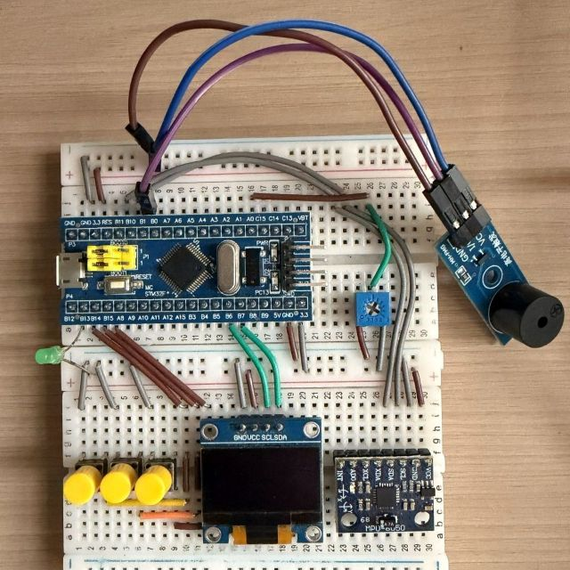

# 基于STM32F103C8T6的智能手表系统

> 这是一个基于STM32F103C8T6的智能手表原型系统，实现了时间显示、菜单交互、游戏、电源管理等功能。

---

## 目录

1. [项目简介](#项目简介)
2. [硬件连接](#硬件连接)
3. [功能列表](#功能列表)
4. [软件设计](#软件设计)
5. [后续规划](#后续规划)
6. [致谢](#致谢)

---

## 项目简介

本项目基于STM32F103C8T6微控制器，结合OLED显示屏、按键、蜂鸣器、MPU6050姿态传感器等模块，实现了一个功能完整的智能手表原型。项目采用裸机开发方式，代码结构清晰，模块化分层设计，便于后续功能扩展和维护。

**主要特点**：
- 裸机开发，代码结构清晰
- 模块化分层设计
- 完整的菜单交互系统
- 多种实用功能（时间管理、游戏、电源管理等）
<div align="center">
<p align="center">
    <br>
    演示效果(因gif压缩原因会有加速)
  </p>
  <br>
  <table>
    <tr>
      <td align="center"><br>主界面</td>
      <td align="center"><br>菜单界面</td>
      <td align="center"><br>时间功能界面</td>
    </tr>
    <tr>
      <td align="center"><br>手电筒界面</td>
      <td align="center"><br>游戏功能界面</td>
      <td align="center"><br>表情包界面</td>
    </tr>
  </table>
</div>

---

## 硬件连接

### 硬件清单

| 模块 | 型号 | 用途 |
|------|------|------|
| 主控 | STM32F103C8T6 | 核心处理器 |
| 显示屏 | 0.96寸OLED (I2C) | 显示界面 |
| 按键 | 3个独立按键 | 用户交互 |
| 蜂鸣器 | 有源蜂鸣器 | 闹钟/倒计时提醒 |
| LED | 发光二极管LED灯珠 | 模拟手电筒 |
| 姿态传感器 | MPU6050 (I2C) | 抬腕检测 |
| 电位器 | 10K欧姆 | 模拟电池电压变化 |
| 仿真器 | ST-LINK | 调试/烧录代码 |

### 引脚连接表

| 模块 | 引脚 | 说明 |
|------|------|------|
| OLED_SCL | PB6 | I2C时钟线 |
| OLED_SDA | PB7 | I2C数据线 |
| 按键1 (进入/返回) | PB13 | 跳转菜单界面/回退上一级目录 |
| 按键2 (选择) | PB14 | 下翻 |
| 按键3 (确定) | PB15 | 进入/数值加/长按开关机 |
| 蜂鸣器 (高电平触发) | PB1 | 闹钟/倒计时输出 |
| LED | PB12 | 模拟手电筒开/关 |
| MPU6050_SCL | PB10 | I2C时钟线 |
| MPU6050_SDA | PB11 | I2C数据线 |
| 电位器 | PA0 | ADC输入(模拟电池电压变化) |

### 实物连接图
<div align="center">
<p align="center">
    <br>
    智能手表实物整体图
  </p>
  <br>
  <table>
    <tr>
      <td align="center"><br>自动息屏/抬手唤醒/按键唤醒</td>
      <td align="center"><br>菜单切换</td>
    </tr>
    <tr>
      <td align="center"><br>设置时间/闹钟/倒计时</td>
      <td align="center"><br>手电筒功能</td>
    </tr>
    <tr>
      <td align="center"><br>谷歌小恐龙游戏</td>
      <td align="center"><br>表情包显示</td>
    </tr>
    <tr>
      <td align="center"><br>模拟电池使用情况</td>
      <td></td>
    </tr>
  </table>
</div>

---

## 功能列表

- [x] **时间显示**：实时显示年/月/日/时/分/秒（日期+时间+星期）
- [x] **菜单导航**：按键控制的四级菜单系统
- [x] **设置时间**：手动修改当前时间
- [x] **倒计时**：设定时间，倒计时归零蜂鸣器提醒
- [x] **闹钟**：设置一次性闹钟，到点蜂鸣器响
- [x] **谷歌小恐龙游戏**：按键跳跃，躲避障碍物
- [x] **手电筒**：按键控制LED开关
- [x] **动态表情**：定时切换显示表情包
- [x] **自动熄屏**：无操作20秒后自动熄屏
- [x] **抬腕亮屏**：MPU6050检测抬腕动作，自动亮屏
- [x] **按任意键亮屏**：可按任意键唤醒熄屏状态
- [x] **电量显示**：ADC读取电压，显示百分比和电池图标
- [x] **长按开关机**：长按key3按键实现软开关机

---

## 软件设计

### 开发环境

| 项目 | 说明 |
|------|------|
| IDE | Keil MDK v5 |
| 编译器 | ARMCC |
| 标准库 | STM32F10x Standard Peripherals Library |
| 版本管理 | Git + GitHub |

采用ST-LINK进行代码下载

### 代码结构

```
STM32_Watch/
├── Start/            # 启动文件和系统配置
├── Library/          # STM32标准外设库
├── System/           # 系统模块
│   ├── Timer.c/h    # 定时器 (TIM2)
│   ├── MyRTC.c/h    # RTC实时时钟
│   └── Delay.c/h    # 延时函数
├── Hardware/          # 硬件驱动层
│   ├── OLED.c/h      # OLED显示驱动 (SSD1306)
│   ├── MyI2C.c/h    # 软件I2C主设备
│   ├── MPU6050.c/h  # 6轴传感器驱动
│   ├── Key.c/h      # 按键输入处理
│   ├── LED.c/h      # LED控制
│   ├── AD.c/h       # ADC电池监测
│   ├── menu.c/h    # 菜单系统
│   ├── dino.c/h     # 恐龙游戏
│   └── SetTime.c/h  # 时间设置
├── User/             # 用户应用入口
└── Project.uvprojx   # Keil工程文件
```

### 核心设计思路

**1. 裸机状态机架构**
- 主循环 `App_Process()` 负责调度所有任务
- 菜单系统采用状态机管理，按键驱动界面切换
- 各个功能模块相互独立，通过函数调用耦合

**2. 按键处理**
- TIM2定时器产生系统时基（10ms）
- 主循环轮询按键状态，软件消抖（连续检测）
- 支持短按（确认/选择）和长按（开关机）

**3. 电源管理**
- 自动熄屏：无操作20秒后关闭OLED显示
- 抬腕亮屏：MPU6050检测加速度变化，超过阈值唤醒屏幕
- 长按开关机：通过软件标志位控制系统运行状态

**4. 游戏逻辑**
- 基于定时器中断的帧刷新机制
- 简单的物理模拟（跳跃、重力）
- 矩形碰撞检测

### 实现细节（待补充）

> 📝 TODO：以下部分正在逐步完善中
>
> - [ ] RTC时间读写与BCD码转换
> - [ ] ADC电压采集与电量百分比换算
> - [ ] MPU6050加速度数据读取与阈值判断
> - [ ] 游戏碰撞检测算法
> - [ ] 长按开关机状态机

---

## 后续规划

- [ ] 代码注释完善与模块化优化
- [ ] 移植FreeRTOS，实现多任务调度
- [ ] 制作实物PCB焊接版本
- [ ] 增加蓝牙通信功能
- [ ] 增加心率传感器扩展

---

## 致谢

本项目为个人学习作品，参考了STM32标准库例程及社区开源资料。

---